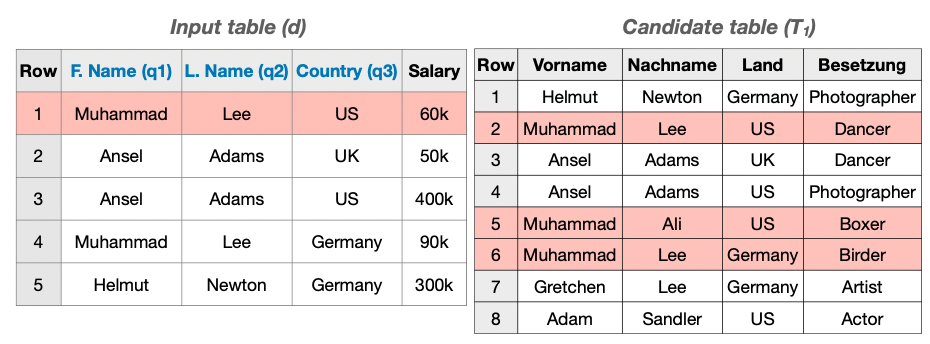

# MATE: Multi-Attribute Table Extraction

Here you can find the code and datasets for the [*MATE: Multi-Attribute Table Extraction*](https://arxiv.org/abs/2110.00318) paper,
which was published at VLDB 2022.

## Abstract
A core operation in data discovery is to find joinable tables for a given table. Real-world tables include both unary
and n-ary join keys. However, existing table discovery systems are optimized for unary joins and are ineffective and 
slow in the existence of n-ary keys. In this paper, we introduce Mate, a table discovery system that leverages a novel 
hash-based index that enables n-ary join discovery through a space-efficient super key. We design a filtering layer 
that uses a novel hash, Xash. This hash function encodes the syntactic features of all column values and aggregates 
them into a super key, which allows the system to efficiently prune tables with non-joinable rows. Our join discovery 
system is able to prune up to 1000𝑥 more false positives and leads to over 60𝑥 faster table discovery in comparison to 
state-of-the-art.

### Running example

In this example, we consider two tables: An input table *d* and a candidate table *T1*.

The user selects *F.Name*, *L.Name* and *Country* as query columns. We use MATE to find the three columns with 
highest joinablility score *J* from *T1*. To do so, we have to find the mapping from query to target columns that allows as
many joins as possible. In this case, we map *F.Name* to *Vorname*, *L.Name* to *Nachname*, and *Country* to *Land* and 
obtain *J = 5*.



## Setup

Having the traditional inverted index defined in the [*DataXFormer paper*](https://cs.uwaterloo.ca/~ilyas/papers/AbedjanICDE16.pdf),
in a Vertica database, the user should generate our novel index using the following function:

```python
def generate_index(main_table: str = 'main_tokenized',
                   super_key_column: str = 'super_key',
                   hash_size: int = 128
    ) -> None:
```
in [index_generation.py](LUH-DBS/MATE/blob/main/src/index_generation.py).
Depending on your system architecture this might take a few hours or even days.

## Usage

After creating the index you can use MATE to find the top-k joinable tables for your dataset using the following class
```python
MATETableExtraction
```
in [MATE.py](LUH-DBS/MATE/blob/main/src/MATE.py).

In our example, we would like to run MATE on the ```movie``` dataset in [movie.csv](LUH-DBS/MATE/blob/main/datasets/movie.csv)
in order to find tables which can be joined with both ```director_name``` and ```movie_title``` columns.

First we create a ```MATETableExtraction``` instance as follows:

```python
top_k = 10
one_bits = 5
bits = 128
mate = MATETableExtraction('movie', '../datasets/movie.csv', ['director_name', 'movie_title'], top_k, 'main_tokenized',
                    one_bits, f'MATE_datasets_k_bits_ones_{top_k}_{bits}_{one_bits}')
```

Then we can run ```MATE``` on our dataset, which will give us the top-10 joinable tables:
```python
mate.MATE(bits)
```